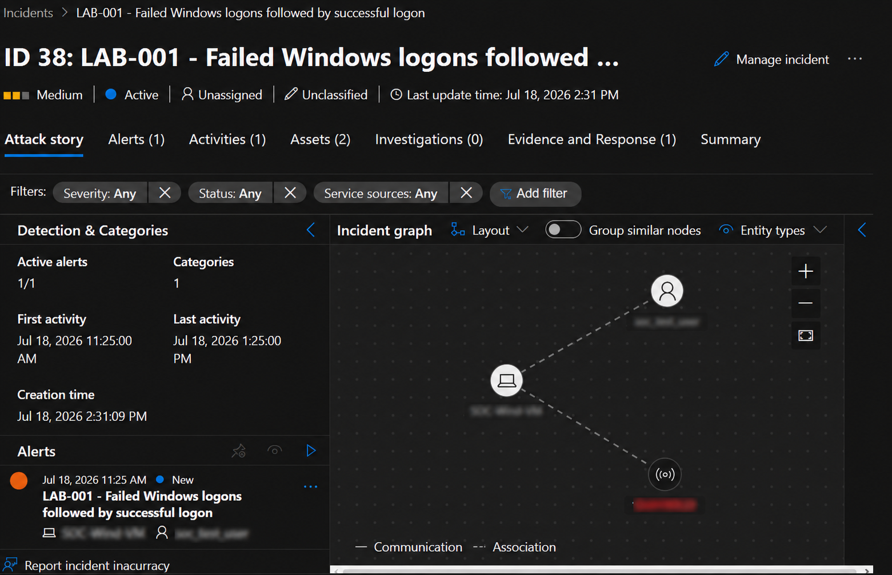
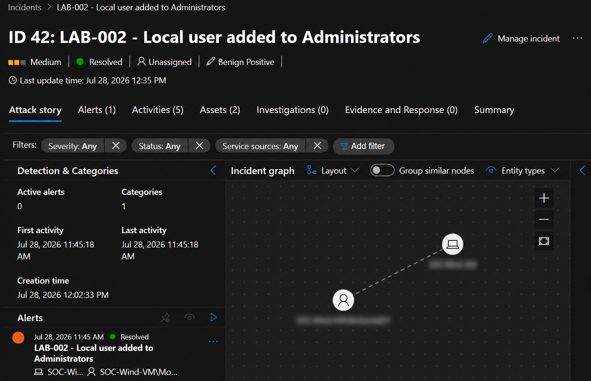
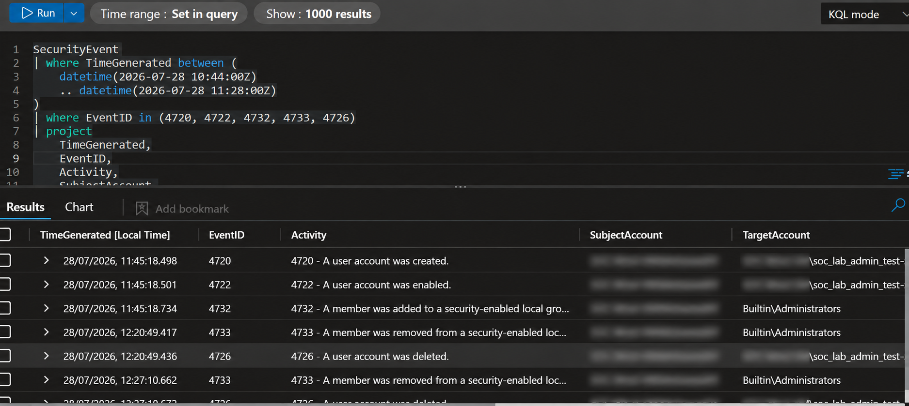
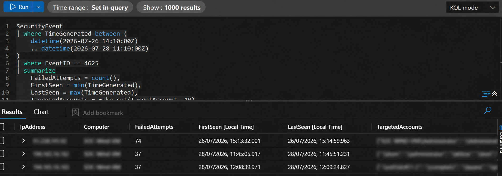
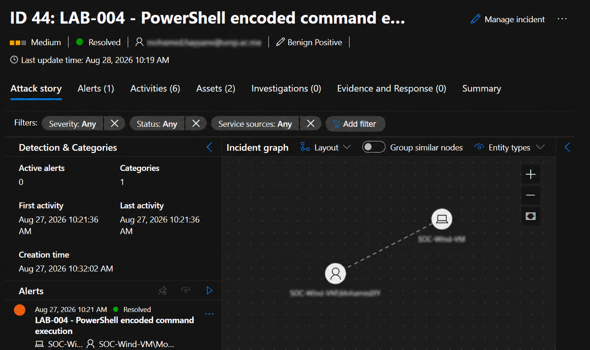
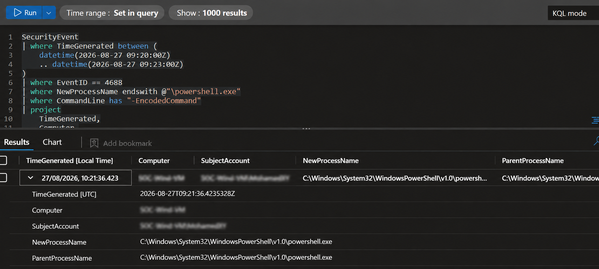
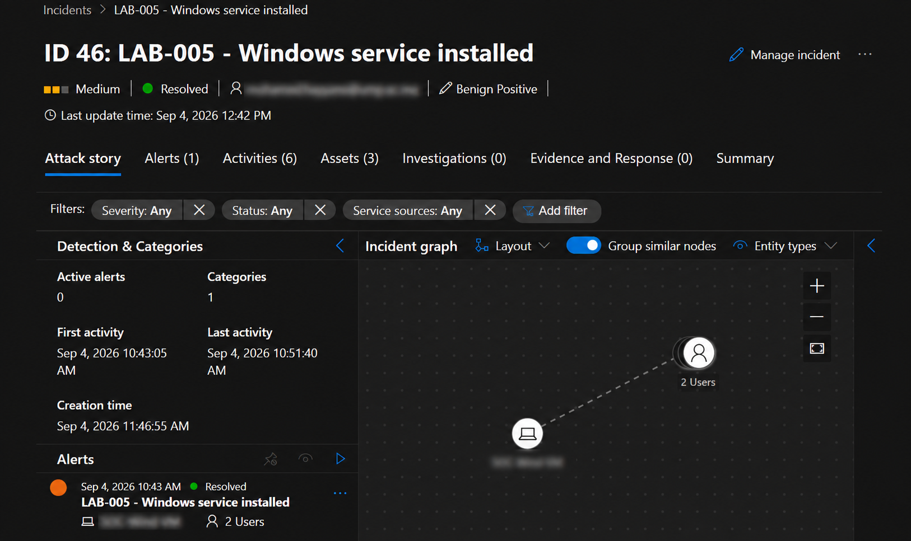
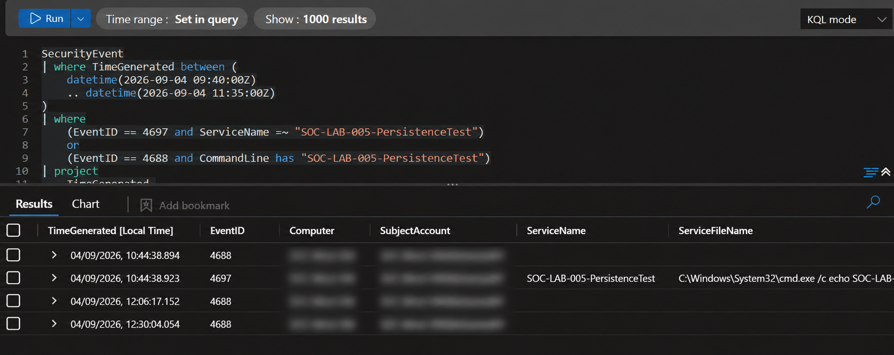

# Visual Evidence Gallery

These screenshots were captured from the Microsoft Sentinel and Microsoft
Defender portals for the authorized home-lab scenarios documented in this
repository. They are evidence of lab work, not evidence from a production
environment.

Personal accounts, email addresses, VM names, source IP addresses and other
environment-specific identifiers have been blurred. Event IDs, rule titles,
timestamps, KQL logic, classifications and safe lab artifact names remain
visible so the investigation can be understood and reviewed.

## LAB-001 — Failed logons followed by success

The screenshot records the initial alert and entity relationship for the
controlled failed-logon scenario. The report documents the final investigation
and closure; this capture intentionally preserves the alert's original active
state.

## LAB-002 — Local account added to Administrators

The incident was resolved as a benign positive after confirming the planned
lab activity. The KQL result then shows account creation, enablement, local
Administrators membership, and cleanup events.

## LAB-003 — Internet-facing RDP password guessing

The KQL aggregation summarizes repeated failed `4625` RDP/NLA authentication
events. Source IP addresses, target host, and targeted-account values are
blurred because they are point-in-time lab observations, not reusable threat
intelligence.

## LAB-004 — Encoded PowerShell execution

The incident view confirms the controlled detection was resolved as a benign
positive. The KQL result identifies `4688` process-creation telemetry and the
`-EncodedCommand` filter used during investigation.

## LAB-005 — Windows service persistence

The incident and KQL result document the controlled service-installation
scenario. The safe lab service name is retained to link the `4697` and `4688`
evidence to the documented simulation; operator and host identities are
blurred.

